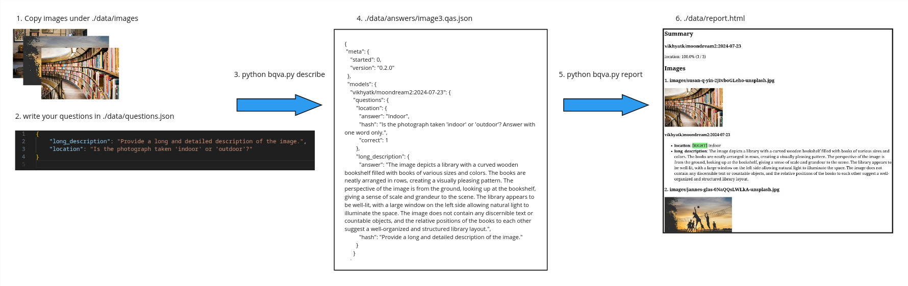

# Batch visual question answering (BVQA)

This python command line tool lets you ask a series of questions 
to a visual language model (VLM) about a collection of images.
It saves the answers in json files (one file per image).

Early prototype developped by [King's Digital Lab](https://kdl.kcl.ac.uk).

## Features

* supported models: Moondream2, SmolVLM, Qwen2-vl, Ollama vision models (e.g. LLama3.2, minicpm-v 2.6)
* suppport for **parallel processing**
  * as simple as launching additional instances of the tool
  * can resume processing after interruption
  * tested on SLURM HPC environment over 60k images
* designed to work with **different vision language models**
  * easy to swap in and out
  * objectively compare different models and select the most appropriate for your task
* granual **caching**: only ask question again if prompt or model has changed
* **reporting**: export images and answers to a web page for manual review by non-technical people (e.g. domain experts)
* **test cases**: write your test cases (image, question -> expected answer) to automate evaluation of prompt and model performance



## Requirements

Follow the [build instructions](build/README.md).

The first time the script runs it will download the visual language model that answers the questions.
Currently, this is [moondream2](https://github.com/vikhyat/moondream) because it's light, fast & performs generally well and is well maintained.

Although a GPU is not mandatory for the moondream model, processing will be very slow without it.

## Usage

By default the root folder for all the input and output is ./data.

### Prepare your input

* **./data/images**: copy your input images (*.jpg) anywhere under that folder
* **./data/questions.json**: your questions (see example in [/test/data/questions.json](/test/data/questions.json))

### Generate descriptions

`python bvqa.py describe`

### Output

* **./data/answers/**: contains the generated answers. Each json file contains all the answers for an image
* **./data/describe.log**: a log of the processing for monitoring and performance purpose

## Options

### Command line

For more options see:

`python bvqa.py -h`

Such as:

* -d to select a different describer (e.g. moondream, qwen-vl, ollama. See section below)
* -m to specify which exact model the describer should use (e.g. vikhyatk/moondream2)
* -v to specify the version/revision of the model (e.g. 2024-08-26)
* -f to filter which image is processed
* -q to filter which question(s) to ask (can be used multiple times)
* -R to use a different root folder for your data
* -t to run your test cases (see section below)

## Reviewing (`report`)

The `report` action (`python bvqa.py report`) generates a HTML document 
under `data/report.html` from your answer files for reviewing purpose. 
It displays your images and the answers.

The following arguments will affect the report:
* -m to only show answers by model which id or version matches on any part of given string
* -q to only show the answers to the given question key(s)
* -f to filter which images are included the report
* -t to only report images from our test cases

## Test cases (`-t`)

`data/test_cases.json` ([see example](test/data/test_cases.json)) is a collection of test cases.

```json
{
    "susan": {
        "long_description": ["book|volume"],
        "location": ["library", "-shop"],
    },
}
```

In this example, we have one test case with key 'susan'. 
The test case applies to all image which path or filename contains that key.
The test case refers to two questions (long_descriptions and location) defined in `questions.json`.
A question has a conditions, e.g. ["library", "-shop"] which must be met to consider an answer correct.

For instance, an image which path or filename contains 'susan'
will have the generated answer to the 'location' question considered correct
if it that answer contains the word 'library' and not 'shop'.
The answer to the long_description will be considered correct if it contains 'book' or 'volume'.

The conditions are python regular expression patterns. 
Except for the optional minus sign at the start, which denotes a negative pattern.

`python bvqa.py -t` will read your test cases from `data/test_cases.json`,
ask questions only about the images which match a test case key,
evaluate the conditions over the answer generated by the describer's VLM
and set a field `correct` to 0 or 1 in the answer file, alongside the `answer` field.

You can subsequently use the `report action` to review the (in)correct answers in a HTML file.

Test cases can help you:
* easily sample your image collection (like -f would but for a single image at a time) without having to add/remove/move/rename files
* iteratively craft your questions to optimise the accuracy of the answers
* more objectively compare different models and select the best one

## Caching

The tool will not ask a question again if an answer has been saved.
It will ask it again only if the question or model has changed. 
This allows you to iteratively reformulate one question at a time 
and only that question will be processed on your image collection. 
Which is convenient considering how much models can be sensitive to the phrasing of a prompt. 
You can combine this with the -f option to test on a few images only.

The -r option tells the tool to ignore the cache. 
When supplied, it will always ask the questions again. 
This is useful in the case where you want to compare the performance between different computing devices (e.g. Nvidia A100 vs L40s GPUs) to estimate the total duration on your entire collection.

## Parallelism

To speed up processing you can run multiple instances of the tool in parallel. 
For this to work they need to write in the same `answers` folder. 
Each instance locks the image by writing a timestamp in the answer file. 
Other instances will skip the image when the timestamp is no older than two minutes.

### SLURM HPC

Simplest approach is to distribute the instances among different GPUs.

Following command on SLURM environment sends two instances (-n 2) to a compute node, each instance will use 4 cpus, 8GB of RAM and one A30 GPU:

`srun -p interruptible_gpu -c 4 --mem-per-gpu 8G --gpus-per-task 1 --constraint a30 -n 2 python bvqa.py describe`

You can keep adding more instances with further calls to `srun` ([srun doc](https://slurm.schedmd.com/srun.html)).

To run an interactive bash on a A40 compute node:

`srun -p interruptible_gpu -c 4 --mem-per-gpu 8G --gpus-per-task 1 --constraint a40 -n 1 --ex
clude erc-hpc-comp190 --pty bash`

[TODO: provide sbatch script]

### Dedicated machine

On a dedicated machine with multiple GPUs, you can launch each instance on a specific GPU like this:

`CUDA_VISIBLE_DEVICES=0 nohup python bvqa.py describe &`

`CUDA_VISIBLE_DEVICES=1 nohup python bvqa.py describe &`

If a single instance uses less than 50% of the GPU VRAM and processing (use `nvidia-smi dmon` to check) 
and less than 50% of CPU & RAM then you can send another instance on the same GPU.

## Tips

Finding the right model and prompts to get good answers is a matter of trial and errors. 
It requires iteratively crafting the questions to get the desired form and accuracy of responses. 
Some models need some nudging. 
And some questions will never be satisfactorily answered by a given model or any curent model. 
Knowing how to rephrase, reframe or simply stop is a bit of an art.

A recommended method is to work one question at a time with a handful of diverse images. 
Engineer the prompt to optimise accuracy. If it is high enough, iterate over a slightly larger sample of images. 
If you are confident the level of error is tolerable and your sample representative enough of the whole collection 
then the question is worth submitting to all the images.

It is more computationally efficient to prepare all your questions before sending them to the entire collection. 
Running one question at a time over N images Q times is much slower than running the script once with Q questions over N images.

After running your questions on a larger proportion of your collection, you might want to spot check the responses here and there to get a sense of how good/usable they are.

As prompt engineering is usually very model-specific, moving to another model can be very disruptive. 
It aways mean reassessing the answers and often means reformulating many questions from scratch.

## Models

### Supported

* Moondream2
* SmolVLM
* Qwen2-VL
* LLama3.2-vision (via Ollama)
* minicpm-v (via Ollama)

#### [moondream](https://huggingface.co/vikhyatk/moondream2) (1.87b, FP16)

Default model, decent responses for general questions, quite fast, even on CPU. Deterministic.

* Downsampling: max 756 pixels any side
* Minimum GPU VRAM: 4.5GB
* CPU (i7 12th gen, 16 cpus): 5 to 40s / question (short to long)
* A30: 1 to 9s / qst

Pros:
* very small, fast and robust
* good for general purpose questions
* good at counting
* trained for OCR

Cons:
* No chat mode? (i.e. pass one image & question, then add more questions)
* Very keen to provide general/contextual descriptions despite instructions to focus on particular element in the image

#### [Smol](https://huggingface.co/HuggingFaceTB/SmolVLM-Instruct)

Alternative to Moondream as it's only slightly bigger.

* Downsampling: max 1536 pixels any side (N=5 for N*384, N can be adjusted)
* Minimum GPU VRAM: 6.2GB
* CPU (i7 12th gen, 16 cpus): 
* A30: 

Pros:
* can be very good at detailed description

Cons:
* prone to repetition with default settings
* can make up details when asked for long description and there's nothing new to say

TODO:
* test on film frames
* test on OCR/forms
* optimise for CPU
* support for 4bits
* test chat mode

#### [qwen-vl](https://huggingface.co/Qwen/Qwen2-VL-2B-Instruct-GPTQ-Int4) (1.07B)

* **GPU only model with higher memory requirements**
* **Harder to install dependencies**
* generally quite good at "focused" OCR/HTR 
* able to work on any image resolution (no downsizing)
* Tried the int4, ~5 x slower than moondream by default. With higher mem consumption

We got noticably better results on form understanding with the 7b+ model than the 2b.
However the VRAM requirement can be very high, especially on larger images.

2b model:

* VRAM: 16GB
* A30: 7 to 40s / qst

7b model:

* VRAM: >40GB
* A30: ?

#### [ollama](https://ollama.com/)

This describer sends questions to an Ollama instance.
Ollama loads and runs (vision) language models in a separate on the same or remote machine.
bvqa sends prompts to Ollama via its web API.

The default model in the ollama describer is [llama3.2-vision:11b](https://ollama.com/library/llama3.2-vision:11b). 
You can use a different model and version with the `-m` and `-v` arguments.
List of [VLMs supported by Ollama](https://ollama.com/search?c=vision&o=newest).

Consult the ollama website to learn how to install it 
and download models.

Note that bvqa communicate with Ollama on port 11435.
Ollama, by default, listens on port 11434.
Use `ssh -L 11435:H:11434` to connect the two 
(where H is the host Ollama is running from).

Advantages of Ollama:

* Ollama is straightforward to install
* it can run remotely by offloading the heavy model computation to a remote GPU
* this lets you run bvqa locally within a comfortable/familiar development environemnt,
* simplifies the local stack, keeping it light
* Ollama comes with many quantised models for efficient execution on more modest compute
* speeds up bvqa startup time by keeping the model in memory between runs
* good suppoort for multiple types of computes (including hybrid, e.g. CPU + GPU)

Disadvatanges:

* it only supports a few VLMs and lags behind huggingface
* e.g. Moondream on Ollama is 6 month behind latest version
* complicates prallel/distributed processing over multiple machines (because we need to run multiple ollama services)

[Ollama can be installed & instantiated manually without sudo](https://github.com/ollama/ollama/blob/main/docs/linux.md#manual-install).

TODO: for parallelism a sbatch should provided to launch ollama on unique port and pass it to bvqa.

#### [llama3.2-vision](https://ollama.com/library/llama3.2-vision)

Supported via the ollama describer.
Good at following more precise instructions.

11b (4bits):

* Downsampling: max  1120x1120 pixels
* Minimum GPU VRAM: 12GB
* Context: 128k
* Output tokens: 2048

#### [minicpm-v](https://ollama.com/library/minicpm-v)

Supported via the ollama describer.

MiniCPM-V 2.6, 8b:

* Downsampling: any aspect ratio and up to 1.8 million pixels (e.g., 1344x1344).
* Minimum GPU VRAM: 7GB
* Context: ?
* Output tokens: ?

### Non supported models

Regularly check [Huggingface VLM leaderboard](https://huggingface.co/spaces/opencompass/open_vlm_leaderboard) and [OpenCompass Leaderboard](https://mmbench.opencompass.org.cn/leaderboard) for new candidates.

* [molmo](https://molmoai.com/#features): open source trained on well curated dataset with good general understanding, comes in 72b, 7b (-o is most open, -d perform better) and 1b.
* [InternVL](https://huggingface.co/collections/OpenGVLab/internvl25-673e1019b66e2218f68d7c1c): v. good performance in benchmarks
* llava-next [NO]: 0.5b needs access to gated llama-3-8b model on HF
* Vila [MAYBE]: docker not building, can't find instructions on how to run model with python
* HuggingFaceM4/Idefics3-8B-Llama3 [MAYBE]: Requires ~24GB VRAM
* Phi-3.5-vision-instruct (4.15B) [TRIED]: demo code out of memory on A30 (24GB) although model is 4.15B x BF16. Requires 50GB VRAM!
* PaliGemma ?
* florence [NO]: it doesn't support free prompt tasks, only set tasks such as global/region OCR or CAPTION

### Adding support for a new type of VLM to this tool

In short, you would need to create a new describer module and class under /describer package. 
It should extend from ImageDescriber (in describe/base.py) and implement answer_question() and _init_model().

### External references

* [Vision-Language Models for Vision Tasks: A Survey, 2024](https://arxiv.org/abs/2304.00685)
* [Abdallah, A., Eberharter, D., Pfister, Z. et al. A survey of recent approaches to form understanding in scanned documents. Artif Intell Rev 57, 342 (2024). ](https://link.springer.com/article/10.1007/s10462-024-11000-0#Sec12)

