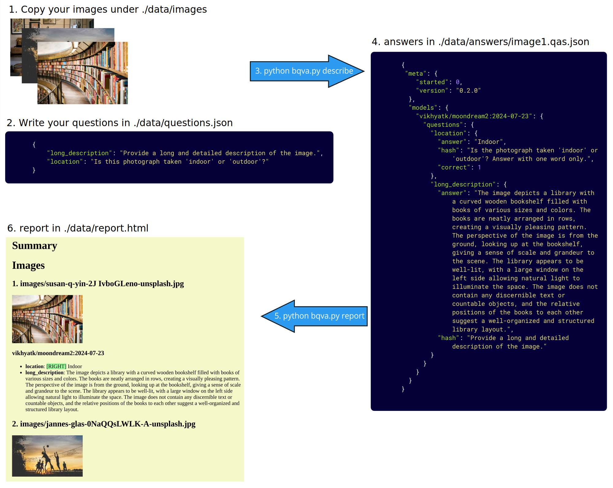

# Batch visual question answering (BVQA)

BVQA is a python command line tool that lets you ask
a series of predefined questions
to a visual language model (VLM) about a collection of images.
It saves the answers in json files (one file per image).

In this tool, a **describer** is a backend for a family of vision language models.

**Status**: prototype developped by [King's Digital Lab](https://kdl.kcl.ac.uk) to support research projects in digital humanities. (Note that we don't have dedicated funding or resources to maintain this application.)

## Main use cases

- efficient extraction of semantic features from a large collection of images
- model selection: objectively compare the performance (quality of responses, resource utilisation, speed) of different models on the same questions and images.

## Features

* supported models: Moondream2, SmolVLM, Qwen-vl, Ollama vision models (e.g. LLama3.2, minicpm-v 2.6)
* suppport for **parallel processing**
  * as simple as launching additional instances of the tool
  * can resume processing after interruption
  * tested on SLURM HPC environment over 60k images
* designed to work with **different vision language models**
  * easy to swap in and out
  * objectively compare different models and select the most appropriate for your task
* granual **caching**: only ask question again if prompt or model has changed
* **reporting**: export images and answers to a web page for manual review by non-technical people (e.g. domain experts)
* **test cases**: write your test cases (image, question -> expected answer) to automate evaluation of prompt and model performance



[Example of a report on test data with various vision language models](https://github.com/kingsdigitallab/kdl-vqa/blob/main/doc/bvqa-tests-2025-03-11.pdf)

## Requirements

This tool has been tested with Python 3.10 on Linux (22.04) machines with a variety of GPUs (1080ti, 4090).

Although a GPU is not mandatory for the moondream model, processing will be very slow without it.
Some models (e.g. Qwen VL 2.5) may require more recent generation of GPUs to process larger images.

BVQA has a `build` action to create a python virtual environment and install all dependencies automatically.

The first time the script runs it will download the visual language model that answers the questions.
Currently, this is [moondream2](https://github.com/vikhyat/moondream) because it's light, fast & performs generally well and is well maintained.

## Usage

By default the root folder for all the input and output is ./data.

In the example below we'll be using 'moondream' as a vision language model. See section below for other describers.

### Install

This action will create a virtual environment and install all python packages
needed to run moondream on CPU and GPU.

`python3 bvqa.py -d moondream build`

Always activate the environment before invoking an action that involves a describer.

`source venvs/moondream/bin/activate`

### Prepare your input

* **./data/images**: copy your input images (*.jpg) anywhere under that folder
* **./data/questions.json**: your questions (see example in [/test/data/questions.json](/test/data/questions.json))

### Generate descriptions

`python bvqa.py -d moondream describe`

### Output

* **./data/answers/**: contains the generated answers. Each json file contains all the answers for an image
* **./data/describe.log**: a log of the processing for monitoring and performance purpose

## Options

### Command line

For more options see:

`python bvqa.py -h`

Such as:

* -d to select a different describer (e.g. moondream, qwen-vl, ollama. See section below)
* -m to specify which exact model the describer should use (e.g. vikhyatk/moondream2)
* -v to specify the version/revision of the model (e.g. 2024-08-26)
* -f to filter which image is processed
* -q to filter which question(s) to ask (can be used multiple times)
* -R to use a different root folder for your data
* -t to run your test cases (see section below)

## Describers and models

A describer is a backend for bvqa that provide support for a family of vision language models.


| Describer (-d) | Model (-m)                                                                                        | Size-Quant | VRAM GB | Duration m:s | Max res   |
| ---------------- | --------------------------------------------------------------------------------------------------- | ------------ | --------- | -------------- | :---------- |
| moondream      | [moondreamm-0_5b-int8](https://github.com/vikhyat/moondream)                                      | 0.5b-int8  | 0       | 4:50         |           |
| moondream      | moondream-2b-int8                                                                                 | 2b-int8    | 0       | ?            |           |
| moondream      | [vikhyatk/moondream2](https://huggingface.co/vikhyatk/moondream2)                                 | 2b:FP16    | 6       | 0:25         |           |
| smol           | [HuggingFaceTB/SmolVLM-Instruct](https://huggingface.co/HuggingFaceTB/SmolVLM-Instruct)           | 2b:BF16    | 11      | 1:51         |           |
| qwen-vl        | [Qwen/Qwen2-VL-2B-Instruct-GPTQ-Int4](https://huggingface.co/Qwen/Qwen2-VL-2B-Instruct-GPTQ-Int4) | 2b:int4    | 7       | 4:53         | unlimited |
| qwen-vl        | [Qwen/Qwen2.5-VL-3B-Instruct](https://huggingface.co/Qwen/Qwen2.5-VL-3B-Instruct) -o              | 3b:BF16    | 21      | 2:49         |           |
| qwen-vl        | [allenai/olmOCR-7B-0225-preview](https://huggingface.co/allenai/olmOCR-7B-0225-preview) -o        | 7b:BF16    | 24      | 3:21         |           |
| ovis           | [AIDC-AI/Ovis2-1B](https://huggingface.co/AIDC-AI/Ovis2-1B) -o                                    | 1b:BF16    | 3       | 0:42         |           |
| ovis           | [AIDC-AI/Ovis2-4B](https://huggingface.co/AIDC-AI/Ovis2-4B) -o                                    | 4b:BF16    | 10      | 1:01         |           |
| ollama         | [llama3.2-vision](https://ollama.com/library/llama3.2-vision)                                     | 11b:Q4_K_M | 12      | 0:59         |           |
| ollama         | [minicpm-v](https://ollama.com/library/minicpm-v)                                                 | 8b:Q4_0    | 7       | 1:28         |           |
| ollama         | [granite3.2-vision](https://ollama.com/library/granite3.2-vision)                                 | 2b:Q4_K_M  | 13      | UNRESPONSIVE |           |

*Tested on Ubuntu 22.04 LTD, 128GB RAM, RTX 4090 (24GB VRAM), AMD Ryzen Threadripper 1950X 16-Core Processor, CUDA 12.2, Nvidia driver 535.183.01. 2025/03/05. Ollama 0.5.13. Four images and four questions. The duration does not always include time to load the model. But always excludes download. VRAM is rounded up. Largest image is 7360x4912. Models resize the images in different ways, which may affect processing speed and quality of answers. OOM: out of memory error.*

*-o flag, when passed to bvqa, enables flash attention (which requires Ampere, Ada, or Hopper GPUs) to reduce memory usage and may increase speed. Without it Qwen would require extremely large amount of VRAM (> 100GB) for a larger image (~3000x3000px).*

### Describers

#### moondream

**moondream-*-int8** models work on CPU only. The model name refer to the filename stored on github moondream repository.

**vikhyatk/moondream2** model works on GPU only. Its name matches the one Hugging Face Hub.

#### ollama

**ollama** model names refer to the exact names used by Ollama to pull or run them. The version (-v) refers to the size (e.g. 2b) and quantisation. If unspecified, the default values come from Ollama library.

By default the describer will call Ollama at http://localhost:11434. You can change this address by setting the BVQA_OLLAMA_HOST environment variable.

Please make sure you have pulled your model with ollama before running the describer.

[List of vision models supported by ollama](https://ollama.com/search?c=vision&o=newest).

#### smol, qwen-vl, ovis

For those describers, the models refer to model names on the Hugging Face hub. In principle the describers should be compatible with any model on Hugging Face what was fine tuned or quantised from smol or qwen2-vl or qwen2.5-vl.

**Qwen** models can crash as they eat up extraordinary amount of VRAM. To keep it under control use the `-o` flag with your `describe` action. It will use flash_attention to drastically reduce memory use. However the flash attention libraries need more recent generations of GPUs. The use -o flag is documented in the model column of the above table.

**ovis** also greatly benefits from `-o` (flash attention), reducing the VRAM use by 3x.

## Reviewing (`report`)

The `report` action (`python bvqa.py report`) generates a HTML document
under `data/report.html` from your answer files for reviewing purpose.
It displays your images and the answers.

The following arguments will affect the report:

* -m to only show answers by model which id or version matches on any part of given string
* -q to only show the answers to the given question key(s)
* -f to filter which images are included the report
* -t to only report images from our test cases

## Test cases (`-t`)

`data/test_cases.json` ([see example](test/data/test_cases.json)) is a collection of test cases.

```json
{
    "susan": {
        "long_description": ["book|volume"],
        "location": ["library", "-shop"],
    },
}
```

In this example, we have one test case with key 'susan'.
The test case applies to all image which path or filename contains that key.
The test case refers to two questions (long_descriptions and location) defined in `questions.json`.
A question has a conditions, e.g. ["library", "-shop"] which must be met to consider an answer correct.

For instance, an image which path or filename contains 'susan'
will have the generated answer to the 'location' question considered correct
if it that answer contains the word 'library' and not 'shop'.
The answer to the long_description will be considered correct if it contains 'book' or 'volume'.

The conditions are python regular expression patterns.
Except for the optional minus sign at the start, which denotes a negative pattern.

`python bvqa.py -t` will read your test cases from `data/test_cases.json`,
ask questions only about the images which match a test case key,
evaluate the conditions over the answer generated by the describer's VLM
and set a field `correct` to 0 or 1 in the answer file, alongside the `answer` field.

You can subsequently use the `report action` to review the (in)correct answers in a HTML file.

Test cases can help you:

* easily sample your image collection (like -f would but for a single image at a time) without having to add/remove/move/rename files
* iteratively craft your questions to optimise the accuracy of the answers
* more objectively compare different models and select the best one

## Caching

The tool will not ask a question again if an answer has been saved.
It will ask it again only if the question or model has changed.
This allows you to iteratively reformulate one question at a time
and only that question will be processed on your image collection.
Which is convenient considering how much models can be sensitive to the phrasing of a prompt.
You can combine this with the -f option to test on a few images only.

The -r option tells the tool to ignore the cache.
When supplied, it will always ask the questions again.
This is useful in the case where you want to compare the performance between different computing devices 
(e.g. Nvidia A100 vs L40s GPUs) to estimate the total duration on your entire collection.

## Parallelism

To speed up processing you can run multiple instances of the tool in parallel.
For this to work they need to write in the same `answers` folder.
Each instance locks the image by writing a timestamp in the answer file.
Other instances will skip the image when the timestamp is no older than two minutes.

### SLURM HPC

Simplest approach is to distribute the instances among different GPUs.

Following command on SLURM environment sends two instances (-n 2) to a compute node, each instance will use 4 cpus, 8GB of RAM and one A30 GPU:

`srun -p interruptible_gpu -c 4 --mem-per-gpu 8G --gpus-per-task 1 --constraint a30 -n 2 python bvqa.py describe`

You can keep adding more instances with further calls to `srun` ([srun doc](https://slurm.schedmd.com/srun.html)).

To run an interactive bash on a A40 compute node:

`srun -p interruptible_gpu -c 4 --mem-per-gpu 8G --gpus-per-task 1 --constraint a40 -n 1 --ex clude erc-hpc-comp190 --pty bash`

[TODO: provide sbatch script]

### Dedicated machine

On a dedicated machine with multiple GPUs, you can launch each instance on a specific GPU like this:

`CUDA_VISIBLE_DEVICES=0 nohup python bvqa.py describe &`

`CUDA_VISIBLE_DEVICES=1 nohup python bvqa.py describe &`

If a single instance uses less than 50% of the GPU VRAM and processing (use `nvidia-smi dmon` to check)
and less than 50% of CPU & RAM then you can send another instance on the same GPU.

## Tips

Finding the right model and prompts to get good answers is a matter of trial and errors.
It requires iteratively crafting the questions to get the desired form and accuracy of responses.
Some models need some nudging.
And some questions will never be satisfactorily answered by a given model or any curent model.
Knowing how to rephrase, reframe or simply stop is a bit of an art.

A recommended method is to work one question at a time with a handful of diverse images.
Engineer the prompt to optimise accuracy. If it is high enough, iterate over a slightly larger sample of images.
If you are confident the level of error is tolerable and your sample representative enough of the whole collection
then the question is worth submitting to all the images.

It is more computationally efficient to prepare all your questions before sending them to the entire collection.
Running one question at a time over N images Q times is much slower than running the script once with Q questions over N images.

After running your questions on a larger proportion of your collection, you might want to spot check the responses here and there to get a sense of how good/usable they are.

As prompt engineering is usually very model-specific, moving to another model can be very disruptive.
It aways mean reassessing the answers and often means reformulating many questions from scratch.

## Guiding principles

* Reproducibility
* Ease of use
* Local or open models (b/c proprietary APIs are not reproducible in the long term)
* Modularity & extensibility
* Parallel processing & optimisations

## External references

* [A Dive into Vision-Language Models](https://huggingface.co/blog/vision_language_pretraining)
* [An Introduction to Vision-Language Modeling](https://arxiv.org/abs/2405.17247v1)
* [Vision-Language Models for Vision Tasks: A Survey, 2024](https://arxiv.org/abs/2304.00685)
* [Abdallah, A., Eberharter, D., Pfister, Z. et al. A survey of recent approaches to form understanding in scanned documents. Artif Intell Rev 57, 342 (2024). ](https://link.springer.com/article/10.1007/s10462-024-11000-0#Sec12)
